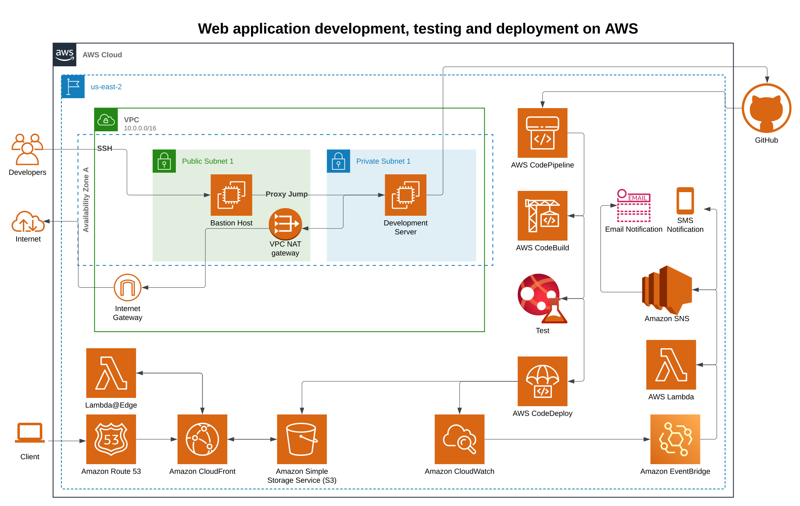

# Hinddeep Purohit's Portfolio

## Architecture 



## Project setup

```
Deploy the infrastructure with the provided main.tf terraform file.
Install dependencies with npm install 
```

### Compiles and hot-reloads for development

```
npm run start
```

### Compiles and minifies for production

```
npm run build
```

### Lints and fixes files

```
npm run lint
```
